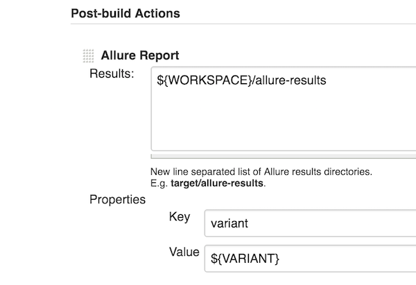
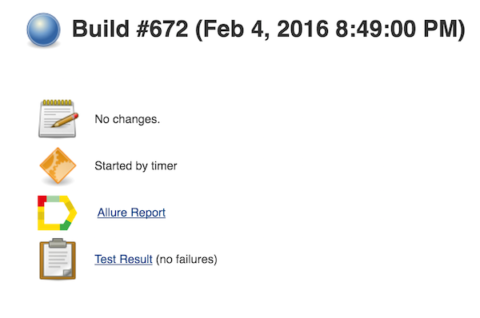
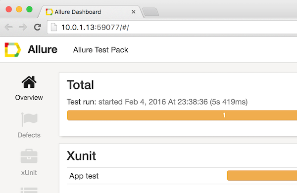

# wdio-allure-reporter
A WebdriverIO reporter plugin to create Allure Test Reports (http://allure.qatools.ru/).

## Configuration
Configure the output directory in your wdio.conf.js file:
```js
exports.config = {
  ...
  reporterOptions: {
		allure: {
			outputDir: 'allure-results'
		}
	},
	...
}
```
`outputDir` defaults to `./allure-results`. After a test run is complete, you will find that this directory has been populated with an `.xml` file for each spec, plus a number of `.txt` and `.png` files and other attachments.

## Displaying the report
The results can be consumed by any of the [reporting tools](http://wiki.qatools.ru/display/AL/Reporting) offered by Allure. For example:

### Jenkins
Install the [Allure Jenkins plugin](http://wiki.qatools.ru/display/AL/Allure+Jenkins+Plugin), and configure it to read from the correct directory:


Jenkins will then offer a link to the results from the build status page:


### Command-line
Install the [Allure command-line tool](http://wiki.qatools.ru/display/AL/Allure+Commandline), and process the results directory:
```bash
allure generate [allure_output_dir] && allure report open
```
This will generate a report (by default in `./allure-report`), and open it in your browser:

